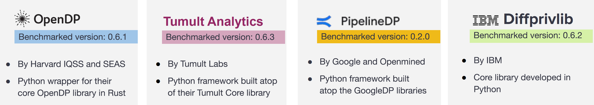
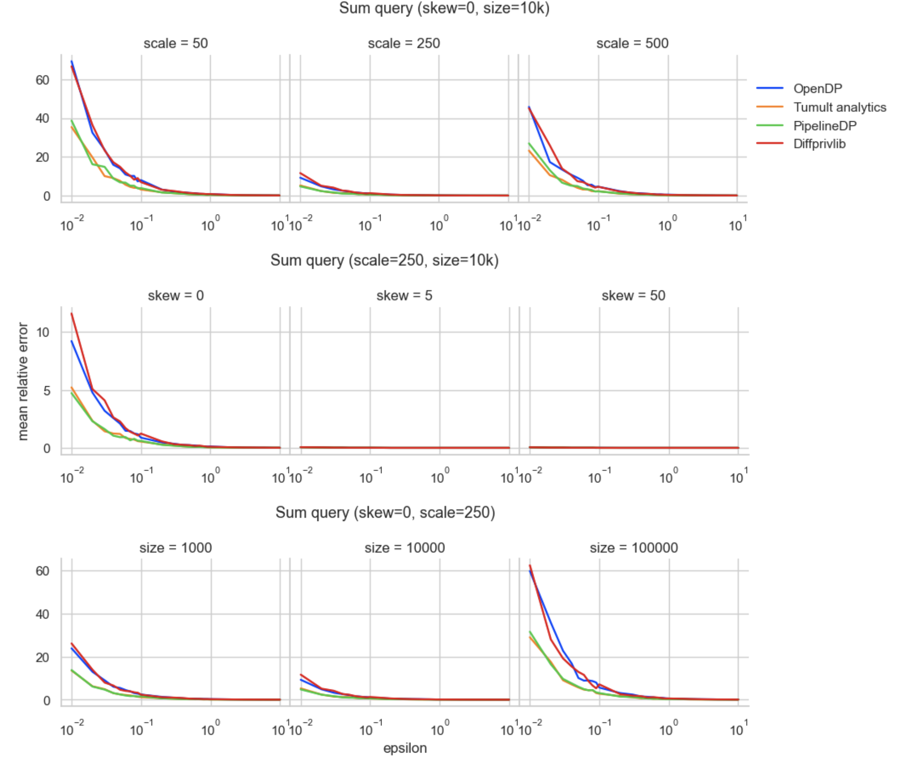
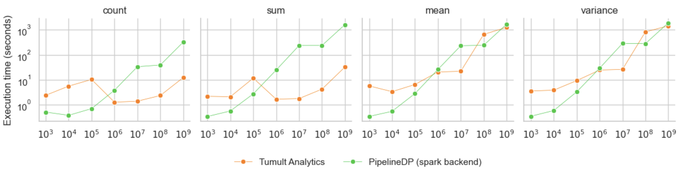

# Benchmarking Differential Privacy Python Tools 
------------------------

This repository contains the implementation of benchmarked differential privacy Python libraries and frameworks. The libraries and frameworks are evaluated based on utility and execution time.



## Sample Experimental Results 
-----------------------

- Mean relative error of the sum query for experiments with synthetic datasets.  




- Execution time of the tools in the Spark environment, experimented on synthetic datasets of varying sizes of upto 1 billion data points.




## How to Execute Queries Using the Libraries/Frameworks on Synthetic Data
------------------------

```bash
# sample command to run a query on a dataset size using a library/framwework 
python3 run_tool.py --size 100k --query VARIANCE  --tool opendp
```

 | Argument | Description                                                                                                               | Type | Default       |
 | -------- | ------------------------------------------------------------------------------------------------------------------------- | ---- | ------------- |
 | size     | Dataset size to run query. Valid values are {`1k`, `10k`, `100k`}                                                         | str  | `10k`         |
 | query    | Query to run. Valid values are { `count`, `sum`, `mean`, `variance`}                                                      | str  | `count`       |
 | tool     | Library/Framework to use. Valid values are { `diffprivlib`, `opendp`, `tmlt_ana`, `pipelinedp_local`, `pipelinedp_spark`} | str  | `diffprivlib` |


## Medium Articles
This git repository is also referenced by our four-part differential privacy articles on [DSAID Medium](https://medium.com/dsaid-govtech):

- Part 1: `Sharing Data with Differential Privacy: A Primer` — A beginner’s guide to understanding the fundamental concepts of differential privacy with simplified mathematical interpretation.
- Part 2: `Practitioners’ Guide to Accessing Emerging Differential Privacy Tools` — Explore the emerging differential privacy tools developed by prominent researchers and institutions, with practical guidance on their adoption for real-world use cases.
- Part 3: `Evaluating Differential Privacy Tools’ Performance` — A comparative analysis of the accuracy and execution time of differential privacy tools in both standalone and distributed environments, with a focus on common analytical queries.
- Part 4: `Getting Started with Scalable Differential Privacy Tools on the Cloud` — A step-by-step guide to deploying differential privacy tools in a distributed environment on AWS services, specifically AWS Glue and Amazon EMR, to support the analysis of large datasets.
    
    The following folders are used as references to Part 4:
    ```
    |- glue/ - Glue differential privacy examples
    |- emr/  - EMR differential privacy examples
    ```

