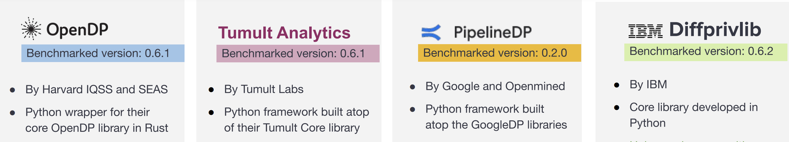

# Benchmarking Differential Privacy Python Tools 
------------------------

This repository is the implementation of the benchmarked differential privacy python libraries and frameworks. 

The libraries and frameworks are evaluated on utility and execution time. 

